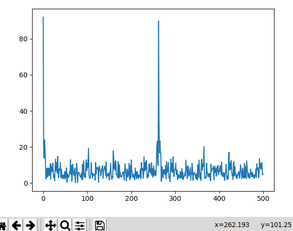

# RF Receiver, Demodulator, and Packet Parser

Have you ever wanted to demodulate packets with your Software Defined Radio and GNU Radio, but haven't found a clear way of getting the samples out of GNU Radio and turning them into bits and bytes?  I have, so I set out on this project, which allows you to extract the bytes from packets from an RFM69 transmitter with an RTL-SDR and a Raspberry Pi (and other platforms that support GNU Radio).  The code is easy to modify for demodulating other OOK modulated signals, including signals from commercial products like weather stations, if the packet structure is known (or discovered).  This provides a powerful mechanism for collecting sensor data from a variety of devices with a single Software Defined Radio.

<p align="center"></p>

Approximately 6000 raw samples (amplitude) from part of a packet:
<p align="center"></p>

Extracted bits from these samples:
<p align="center"></p>

Full packet bytes (all 64k samples):

`2d:d4:15:ff:ff:00:00:48:65:6c:6c:6f:20:57:6f:72:6c:64:20:23:35:39:39:30:09:87:80 -......Hello World #5990...`


[packetdemod.py](packetdemod.py) demodulates OOK modulated packets from an RFM69 transmitter, as an example.  The fine folks at Adafruit provide a board with an Arduino compatible microcontroller (Atmel) and an RFM69 transmitter that makes it easy to send sensor data over the air to your RTL-SDR, while running on batteries that can last over a year. They make several versions of this board that operate on the 433MHz and 900MHz ISM bands.  This receiver project can be used with any of the boards that use the RFM69 radios.  Since the default in the project uses 915MHz, the [Adafruit Feather 32u4 RFM69HCW RadioFruit](https://www.adafruit.com/product/3076) works well for the task.  These boards also let you read the voltage level of the battery and send it over the air, providing a handy way to notify yourself when the battery is getting low.  And in sleep mode, this device only uses 300uA when not transmitting or processing, resulting in extremely long battery life.

<p align="center"></p>

The [transmitter.ino](transmitter/transmitter.ino) file can be loaded onto the RFM69 transmitter via the [Arduino IDE](https://www.arduino.cc/en/Main/Software).  Instructions for loading the Feather 32u4 RFM69HCW using the Arduino IDE can be found [here](https://learn.adafruit.com/adafruit-feather-32u4-radio-with-rfm69hcw-module/using-with-arduino-ide).  Make sure to add the [Adafruit boards manager URL](https://learn.adafruit.com/add-boards-arduino-v164/setup) to the IDE if you haven't already.  Also, you'll need the [RadioHead](http://www.airspayce.com/mikem/arduino/RadioHead/) Arduino library.  The `transmitter.ino` example is adapted from one of the RadioHead examples. 

You'll also need to apply the [patch](RadioHead.patch) for RadioHead to disable [whitening](https://mrmekon.tumblr.com/post/17824495815/rf-transmission-whitening).  Run this command from your Arduino directory, replacing the `..` with the path to the `RadioHead.patch` file:

`patch -p1 <../RadioHead.patch`  

## Installation

As of the time I wrote this program, GNU Radio doesn't run on Raspbian -- it exits with a [corruption error](https://stackoverflow.com/questions/46635871/error-double-linked-list-on-raspberry-pi3/56918931#56918931).  Fortunately, GNU Radio runs properly on Ubuntu MATE, which is [available here](https://ubuntu-mate.org/raspberry-pi/) for the most popular versions of Raspberry Pi.  Note that Ubuntu MATE isn't currently supported on Raspberry Pi's with the ARMv6, like the Pi 1 or Pi Zero.  Follow these steps to install Ubuntu MATE and GNU Radio:  

Once Ubuntu MATE is downloaded, uncompress it with `unxz -d <filename>`.

Then copy it to a microSDHC card with the following command (substituting your filename and device name):

`sudo dd if=ubuntu-mate-18.04.2-beta1-desktop-armhf+raspi-ext4.img of=/dev/mmcblk0 status=progress bs=4M`

Boot up the RPi, and install software updates: 

`sudo apt update`

`sudo apt upgrade`

Install rtl-sdr drivers, following the instructions at [drwxr.org](https://drwxr.org/2016/10/installing-rtl-sdr-rtl2832u-driver/).

Then install GNU Radio and the osmocomm plugin:

`sudo apt install gnuradio`

`sudo apt install gr-osmosdr`

## Other operating systems

You don't need a Raspberry Pi to run this software -- it should run on any system supported by GNU Radio.  You can install the RTL-SDR drivers and GNU Radio on an Ubuntu system using the instructions above.  It is also possible to run [GNU Radio on Windows](https://wiki.gnuradio.org/index.php/WindowsInstall), and in this case, you'll need to make sure to run it in the gnuradio python environment, as python is particular about consistent compiler use (see [here](http://www.gcndevelopment.com/gnuradio/index.htm) for more info).


## Usage

You can install as many transmitters as you want, and they can all use the same frequency.  Just configure them to transmit at a random interval.  For instance, 60 seconds + a random number between 1 and 5.  Or every 15 to 30 seconds plus a random number.

Radios like the RFM69 are especially useful when you have the need for sensors in an area where WiFi is unavailable, or when sensors need to be battery powered.  The RFM69 uses much less power than a typical microcontroller with WiFi like the ESP8266, which allows for sensors that can transmit for months or even years on battery power.

To launch the program simply run the following command:

`python packetdemod.py`

By default, it displays debug info about each packet to stdout, but if you change `graph = False` to `graph = True`, it will display a graph of the samples for each packet that it detects. 

### Incorporating the receiver code

If the packetdemod.py program doesn't "just work" when launched as specified above, you might need to update it with the autogenerated `top_block.py` code from your version of GNU Radio.  To do this, first load the [packetdemod.grc](packetdemod.grc) flow graph into GNU Radio Companion.  Then launch the flow graph, so that GNU Radio Companion generates the file called `top_block.py`.  Different versions of GNU Radio import different modules, and sometimes those differences can be fatal (e.g. importing `PyQt4` vs `PyQt5`).  So you can use the python program called [incorporate.py](incorporate.py) that inserts the packet demodulator code (`radio.py`) into the autogenerated code specified on the command line.  Just specify the name of the `top_block.py` program, `radio.py`, and the output file (`packetdemod.py`):

`python incorporate.py top_block.py radio.py packetdemod.py`

This will overwrite the file `packetdemod.py` with the new code.  Note that since `radio.py` is the authoritative source of the packet demodulator code, make sure to edit this file if you make any updates you'd like to keep. 

If packetdemod.grc won't open in your version of GNU Radio Companion, just create a new flow graph that looks like the one below.

## How it works

At a high level, GNU Radio collects samples from the RTL-SDR and sends the samples to the demodulator code, which triggers when it detects a signal via a threshold test, then performs clock recovery and frame synchronization, and finally decodes fields from the packet. 

The GNU Radio flowgraph is simple and straightforward.  Only four blocks are needed to get the samples into the packet demodulator code.  If you disable the ZMQ PUSH Sink block and execute the flow graph, you'll visually see running spectrographs of the signal before and after it is filtered.  UI range sliders (not shown) let you adjust the receive frequency and the channel while the radio is receiving. 

<p align="center"></p>

<p align="center"></p>

### Filter on the desired frequency

The first thing we need to do in the flow graph after we get IQ samples from our SDR (the RTL-SDR Source block) is to create a bandpass filter on the frequency that we will be receiving packets on (as seen in the Post-filter spectograph above).  Filtering is required if other signals are present within the bandwidth being captured by the SDR.  In the flowgraph, the bandpass filter lets us specify the low and high cutoff frequencies, and the transition width, which controls how quickly the signal is attenuated above and below the high and low cutoff frequencies.  The lower the transition width value, the more CPU is needed for the filter, and the faster the frequency rolloff; a reasonable balance between filter performance and computing resources for this application is 1000, and you can experiment with values above and below that value to suit your needs if desired.  


### Convert IQ signal to magnitude values

The `Complex to Mag` block converts the IQ signal from rectangular notation to polar notation, and outputs the magnitude portion of the signal to the ZeroMQ block.  The magnitude value provides the amplitude of the signal at every sample, making it straightforward to threshold the signal and  perform clock recovery on it later. 

### ZeroMQ for sending samples to the demodulator

The main recommended way to get samples out of GNU Radio and into a program is via ZeroMQ.  There are other ways, such as via files or TCP and UDP sinks, but ZeroMQ is very flexible, and it is straightforward to setup.  Just about every modern language has a [ZeroMQ binding](http://zeromq.org/bindings:_start) written for it.  ZeroMQ is a messaging system that allows senders and receivers to exchange messages.  You can read more about it [here](http://zeromq.org/intro:read-the-manual).  In this case, GNU Radio sends magnitude values as 32-bit floating point values, and the demodulator code receives them, interprets them as floats, and puts them in a ring buffer (in this case, a [deque](https://www.geeksforgeeks.org/deque-in-python/)).  You can run your zmq consumer in a separate process if you like, as zmq can use TCP, but I kept everything in one python program for ease of use.  It is handy to be able to run the demodulator code in the same process as GNU Radio. 

### Trigger on signal and store packet samples

Once the amplitude values have been received by the demodulator and are in the deque, we need to detect when we have a signal vs when there is only noise.  There are various methods for doing this, and we are using a simple threshold value.  Other methods are more efficient, and some can allow us to demodulate a signal very close to 0 dB Signal to Noise ratio, but the simple threshold is fine for this project.

In our case, if the amplitude is >= 0.025, then we assume we have a signal, and if it is below, we assume there isn't a signal.  Once we have determined that we have a signal, we store all of the amplitude values until we have at least 6000 samples of no signal at the end of the packet.  Note that since we aren't doing whitening or manchester encoding on the signal, we can't have 6000 samples worth of zero bits together without a one bit in there somewhere, or the algorithm will think we are at the end of the packet prematurely.  At 250 samples per bit, that is 24 bits, or 3 bytes worth of zeros (we must have fewer zeros than this or the packet will be truncated).  But this value can be adjusted for the expected number of zeros in a packet, and if we added dewhitening or manchester decoding to our program, that would solve the problem in most or all scenarios respectively (more on this below). Also note that the total number of amplitude values (samples) needs to be a multiple of a power of 2, or the fft used during clock recovery below will take a long time to execute (likely reverting to a DFT, rather than an optimized FFT).  In our case, we ensure that our packet has an exact multiple of 8192 samples.   

### Whole Packet Clock Recovery

Michael Ossmann presented on this topic at GRCON16: [video](https://www.youtube.com/watch?v=rQkBDMeODHc)

Ossmann's demonstration code, used in this project: [wpcr.py](https://github.com/mossmann/clock-recovery/blob/master/wpcr.py)

As mentioned in the video, one of the nice things about using the whole packet for clock recovery is that we have so much more data available to make a more accurate assessment of the clock rate than old algorithms like Muller and Muller that are constrained by limited memory.  When we're sampling a 1000 baud signal at 250ksps, we have 250 samples per bit, and about 65k samples per 33 byte packet.  That is a lot of samples to do an analysis on via an FFT, which allows us to come pretty close to the noise floor and still come up with an accurate estimate of the clock (reducing bit error rate).  In addition, the clock can be accurately recovered, even when there are strings of bits that are all 1 or all 0, something that causes problems for traditional clock recovery algorithms.  [Polyphase clock recovery](https://wiki.gnuradio.org/index.php/Guided_Tutorial_PSK_Demodulation) allows for low SNR clock recovery, so it is a good alternative, but I'm using whole packet clock recovery here because it is so easy to understand and so straightforward. 

Here is an example set of samples for a few bits of our packet:

<p align="center"></p>

#### Finding the midpoint
Once we have the samples, we're ready to clean up the signal.  Ossmann's midpoint function thresholds the signal, making it easy to see what parts of the signal are high and low -- in this case, high amplitude (one) and low amplitude (zero).  Notice how some regions of one's last longer than others -- this represents a string of two or more one's strung together.  Since too many ones or zeros together normally confuses clock recovery algorithms, the traditional way to handle this situation is with algorithms like [whitening](https://mrmekon.tumblr.com/post/17824495815/rf-transmission-whitening) or [manchester coding](https://en.wikipedia.org/wiki/Manchester_code) that create transitions between one and zero even when transmitting bytes that are all ones or all zeros.  In the case of manchester coding, it guarantees regular transitions, to ensure that the clock recovery algorithm won't lose synchronization.  In our case, using whole packet clock recovery allows for more reliable clock recovery, even with long strings of ones or zeros.   

<p align="center"></p>


#### Finding the clock frequency

In order to find the clock frequency, we need to identify the pulse rate.  One way to do this is to take the square of the first discrete difference of the output of the midpoint function.  The numpy.diff() function makes this easy.  

```
    b = samples > midpoint(samples)
    d = numpy.diff(b)**2
```

Notice how the orange line below shows a pulse at the beginning and end of each "one" from the midpoint graph above: 

<p align="center"></p>

Once we have the pulses, we can feed them into an FFT (via `f = scipy.fft(d, len(samples)`).  In this case, all 65536 points from the first discrete difference are fed into an FFT.  Here is a graph of the first couple dozen peaks of the FFT output.  The X axis represents the bin numbers of the FFT.      
<p align="center"></p>

The clock frequency is typically the highest amplitude fundamental frequency with prominent harmonics.  In the graph above, notice the even spacing between peaks.  It is clear that the fundamental frequency is at about bin 250, and we see a peak at each multiple of that bin/frequency.  The first peak is the DC offset, and the second peak is the bin of the fundamental frequency.  The graph below is zoomed in on the peak around bin 250.  We can see now that the peak is actually around bin 262. 
<p align="center"></p>

From this, we can calculate the clock frequency at approximately 262 * 250000 / 65536 = 999.45.  That means that our clock rate is about 1000 pulses per second, or 1000 baud (symbols/sec).  Since in our case, one bit is made up of two symbols (0 and 1), our bit rate is the same as the baud: 1000 bits per second.  Note that the x=262.193 number represents the cursor position as I hovered the mouse over the peak, so it doesn't represent an actual bin number -- the bin numbers are integers, and the bin with the peak in this case is 262.


#### Thresholding (slicing) the bits

Once the clock frequency is determined, each time slice can be aligned with the transition edges, with the number of samples per time slice being based on the clock frequency.  In this example, there are 250 samples in each time slice, and each time slice contains one symbol.  Ossmann's slice_bits() function loops through all the samples and creates symbols for each time slice in the packet:

```
    symbols = []
    for i in range(len(samples)):
        if clock_phase >= 1:
            clock_phase -= 1
            symbols.append(samples[i])
        clock_phase += cycles_per_sample
```

Then the symbols can be turned into bits by testing whether each symbol is above or below the average:

```
    symbols_average = numpy.average(symbols)
    bits = (symbols >= symbols_average)
```

The result is an array of bits that line up with the signal as follows:

<p align="center"></p>


### Preamble and sync word detection

At the beginning of the packet, there is traditionally a series of alternating ones and zeros called a preamble, which makes it easy for clock recovery algorithms to lock onto the clock frequency before the packet starts.  We don't use it directly, because we are doing clock recovery on the whole packet. 

A sync word is a pre-determined sequence of bits that is known by both the transmitter and receiver, used for [frame synchronization](https://en.wikipedia.org/wiki/Frame_synchronization).  The sync word is necessary for the demodulator to determine which bit marks the start of the packet, when there is a preamble of unknown length (as is sometimes the case).  Without a sync word, it may be difficult or impossible to tell where the packet starts, and even being one bit off can change all of the bytes of the packet.  The sync word needs to be long enough to uniquely detect it.  The RFM69 uses a 2 byte sync word.  The first bit of the payload is the bit immediately following the sync word, and since the sync word is of a predetermined length, it is straightforward to determine the first bit of the payload. Here is the output of the program when a packet is received (with debugging on):

```
peak frequency index: 262 / 65536
samples per symbol: 250.137405
clock cycles per sample: 0.003998
clock phase in cycles between 1st and 2nd samples: 0.744343
clock phase in cycles at 1st sample: 0.742344
symbol count: 262
invalid packet count: 0 / 10
average amplitude: 0.151361229589
[0, 1, 0, 1, 0, 1, 0, 1, 0, 0, 0, 1, 0, 1, 1, 0, 1, 1, 1, 0, 1, 0, 1, 0, 0, 0, 0, 0, 1, 0, 1, 0, 
 1, 1, 1, 1, 1, 1, 1, 1, 1, 1, 1, 1, 1, 1, 1, 1, 1, 0, 0, 0, 0, 0, 0, 0, 0, 0, 0, 0, 0, 0, 0, 0, 
 0, 0, 1, 0, 0, 1, 0, 0, 0, 0, 1, 1, 0, 0, 1, 0, 1, 0, 1, 1, 0, 1, 1, 0, 0, 0, 1, 1, 0, 1, 1, 0, 
 0, 0, 1, 1, 0, 1, 1, 1, 1, 0, 0, 1, 0, 0, 0, 0, 0, 0, 1, 0, 1, 0, 1, 1, 1, 0, 1, 1, 0, 1, 1, 1, 
 1, 0, 1, 1, 1, 0, 0, 1, 0, 0, 1, 1, 0, 1, 1, 0, 0, 0, 1, 1, 0, 0, 1, 0, 0, 0, 0, 1, 0, 0, 0, 0, 
 0, 0, 0, 1, 0, 0, 0, 1, 1, 0, 0, 1, 1, 0, 1, 0, 1, 0, 0, 1, 1, 1, 0, 0, 1, 0, 0, 1, 1, 1, 0, 0, 
 1, 0, 0, 1, 1, 0, 0, 0, 0, 0, 0, 0, 0, 1, 0, 0, 1, 1, 0, 0, 0, 0, 1, 1, 1, 1, 0, 0, 0, 0, 0, 0, 
 0, 0, 0, 0, 0, 0, 0, 0, 0, 0, 0, 0, 0, 0, 0, 0, 0, 0, 0, 0, 0, 0, 0, 0, 0, 0, 0, 0, 0, 0, 0, 0, 
 0, 0, 0, 0, 0, 0]
2d:d4:15:ff:ff:00:00:48:65:6c:6c:6f:20:57:6f:72:6c:64:20:23:35:39:39:30:09:87:80 -......Hello World #5990...
```

Notice that the beginning of the packet contains 8 bits of preamble: `1, 0, 1, 0, 1, 0, 1, 0` (the first zero is before the beginning of the packet).  The next 2 bytes contain the sync word: `0, 0, 1, 0, 1, 1, 0, 1, 1, 1, 0, 1, 0, 1, 0, 0`, which is equal to to `2d:d4` in hex.  

The following code is what aligns the bits of the packet with the sync word so that all of the bits are properly aligned to their corresponding bits.  It searches the first 50 bits of the packet for the sync word, and discards everything before it.  The `bits` list contains the list of bits above. 

```
    # Align to sync word for beginning of packet
    for i in range(1,50):
        syncword = [0,0,1,0,1,1,0,1,1,1,0,1,0,1,0,0]
        tmpbits = bits[i:]
        if(cmp(syncword,tmpbits[:16].tolist()) == 0):
            bits = bits[i:]
            break
```


### Converting bits to bytes

Once we have a sequence of bits following the sync word, it is straightforward to convert the bits to bytes -- we just convert each series of 8 bits into corresponding bytes.  The getbytes() function does this for each byte.  The first part of the parsepacket() function calls the getbytes() function for each series of 8 bytes:

```
    bytes = ''
    for b in getbytes(iter(bits)):
        bytes += str(chr(b))
```

The result is a list containing the packet bytes.  Printing the hexadecimal and printable ASCII characters of the packet makes it easy to see the contents of the packet.  Non-printable ASCII characters are represented by a period (.): 

`2d:d4:15:ff:ff:00:00:48:65:6c:6c:6f:20:57:6f:72:6c:64:20:23:35:39:39:30:09:87:80  -......Hello World #5990...`


### Parsing the packet

When we have a string of bytes and the packet header format, we can parse out each field of the header as well as the payload and message of the packet.  In this case, the RFM69 allows for a variable length packet, and the [datasheet](https://cdn-shop.adafruit.com/product-files/3076/RFM69HCW-V1.1.pdf) provides the header format:  
<p  align="center"></p>

Note that the packet length field is one byte, so the packet can accommodate a message length of 255 characters plus one address byte (in this case, the length doesn't include the sync word).  Parsing the header fields is as simple as extracting single bytes for 8-bit fields (e.g. `length = ord(bytes[2])`), and for multi-byte integer fields, the process is determined by the encoding of the datatype, and may include bit shifting and adding (e.g. `syncword = (ord(bytes[0])<<8) + ord(bytes[1])`) 

Here is the breakdown of the fields in our packet above:

```
Sync word: 2d:d4
Length: 0x15 (21 decimal)
Address: 0xff
Message: ff:00:00:48:65:6c:6c:6f:20:57:6f:72:6c:64:20:23:35:39:39:30:09 (...Hello World #5990.)
CRC: 87:80
```

Since we know that the packet length is 21 bytes, we can use that to discard the trailing zero bits that come after the CRC, which we saw above. They're not part of the packet -- they just represent the absense of a carrier after the end of the packet. 

## Beyond demodulation

This example packet has a text string in the message with an incrementing integer converted to a character string, but there are many ways to encode data in bytes. You can use 2's compliment for signed integers, Binary Coded Decimal for numbers that are easily human readable in hex but take up less space than strings, IEEE 32-bit floating point numbers, and more. Each has advantages and disadvantages, and it is just a matter of choosing the best encodings for the application. 

Messages aren't limited to data.  You could include higher level protocol headers for processing by other networking equipment or applications.  For example, the first portion of the message could contain an IP packet header, with the destination IP address of a device on the Internet or your local network.  Your receiver could act as a gateway, and route the packet from your RFM69 network to the host or next hop on your Ethernet network.  You could include a UDP header inside your IP header in the packet, so that an application running on the destination host could listen on the specified UDP port number, and receive the data from your RFM69 device.  If the destination IP address is a host on the Internet, the packet would travel all the way from your RFM69 device to that destination IP address on the Internet.
